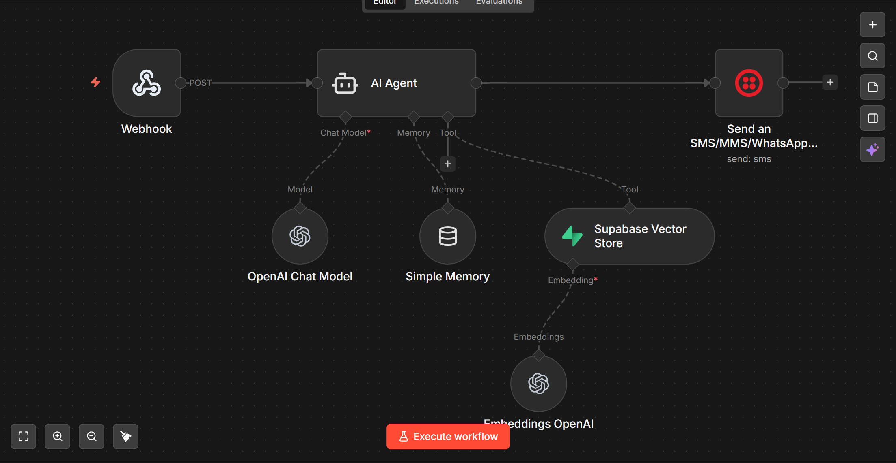

# AI Interview Bot — Email & WhatsApp Automation


## The Problem

Job applications are one-directional. You send a resume, hope someone reads it, and wait. There's no way to demonstrate your actual skills in the application itself — your resume *talks* about what you can build, but it doesn't *show* it.

## The Solution

An AI-powered interview bot that represents me in real-time conversations via **email** and **WhatsApp**. Ask it anything — my background, projects, technical skills, salary expectations, or how the bot itself was built. It answers in first person, maintains conversation context, and even has built-in salary negotiation logic.

The application IS the portfolio piece.

## How It Works

Send an email or WhatsApp message → n8n workflow triggers → AI Agent retrieves relevant information from a 62-entry RAG knowledge base → generates a conversational, first-person response → replies via the same channel.

## Architecture Overview

### Workflow 1: Data Ingestion

```
Manual Trigger → Google Sheets (62 entries) → Edit Fields → Supabase Vector Store
                                                                    ↑
                                                            OpenAI Embeddings
                                                            (text-embedding-3-small)
```

### Workflow 2: Email Agent

```
Gmail Trigger (1-min polling)
        │
        ▼
    IF Node (spam filter — blocks self-replies, noreply, system emails)
        │
        ▼
┌───────────────────────┐
│      AI Agent         │
│  ┌───────────────┐    │
│  │ Supabase      │    │  ← RAG: retrieves top 4 relevant knowledge chunks
│  │ Vector Store  │    │
│  └───────────────┘    │
│  + Simple Memory      │  ← Tracks conversation per email thread
│  + OpenAI Chat Model  │
└───────────┬───────────┘
            ▼
    Gmail Reply Node     → Threaded reply back to sender
```

### Workflow 3: WhatsApp Agent

```
Webhook (POST — Twilio)
        │
        ▼
┌───────────────────────┐
│      AI Agent         │
│  ┌───────────────┐    │
│  │ Supabase      │    │  ← Same RAG knowledge base
│  │ Vector Store  │    │
│  └───────────────┘    │
│  + Simple Memory      │  ← Tracks conversation per phone number
│  + OpenAI Chat Model  │
└───────────┬───────────┘
            ▼
    Twilio WhatsApp Node → Reply via WhatsApp
```

## Knowledge Base Structure

62 entries across 11 categories, stored as vector embeddings in Supabase (pgvector):

| Category | Entries | Covers |
|----------|---------|--------|
| Bot Identity | 3 | Who the bot is, how to redirect to human |
| Professional Background | 6 | Career summary, self-taught journey, hacker mindset |
| Work Experience | 8 | Amazon roles, brands managed, achievements |
| Skills & Tools | 10 | n8n, OpenAI, Anthropic, prompt engineering, Slack, Make/Zapier |
| Portfolio Projects | 8 | BDM, RAG Voice, Financial Agent, Email Drafter |
| Salary & Compensation | 1 | Range + negotiation strategy |
| Why Fairly | 4 | Motivation, company research, culture fit |
| About Fairly | 4 | Company details, founders, business model |
| Technical Architecture | 5 | How this bot works, debugging experience, monitoring |
| Common HR Questions | 5 | Strengths, weaknesses, availability, remote work |
| Meta & Fallback | 3 | Self-aware responses, edge case handling |

## Security & Prompt Engineering

The system prompt includes multiple protection layers:

- **Prompt Injection Defense** — Rejects attempts to reveal system prompt, change persona, or override instructions
- **Salary Protection** — Never reveals minimum, never discusses past salary, follows strict negotiation sequence
- **Hallucination Prevention** — Only answers from vector store data, never invents skills or experiences
- **Self-Reply Loop Prevention** — IF node filters out the bot's own outgoing emails
- **Spam Filtering** — Ignores system emails, newsletters, and automated notifications
- **Channel-Aware Responses** — Under 100 words for WhatsApp, under 200 for email
- **Personality Controls** — Sounds like a real person, not a corporate chatbot

## Technical Highlights

- **Agentic RAG Pattern:** AI Agent autonomously decides when to query the vector store based on the question
- **Multi-Channel Delivery:** Same knowledge base, same AI logic, two different delivery channels (email + WhatsApp)
- **Email Threading:** Gmail Reply operation ensures conversations stay in a single thread
- **Session Management:** Simple Memory keyed by `threadId` (email) and phone number (WhatsApp) for per-conversation context
- **Salary Negotiation Logic:** Multi-step conditional prompt engineering — asks for employer's range first, persists once, then shares range with constraints
- **Self-Describing Architecture:** When asked "how were you built?", the bot explains its own technical stack from the knowledge base

## Tools & Integrations

| Tool | Role |
|------|------|
| n8n | Workflow orchestration & AI agent framework |
| OpenAI API | Chat model (GPT) + text-embedding-3-small |
| Supabase | PostgreSQL vector database (pgvector) |
| Gmail | Email trigger (polling) + threaded replies |
| Twilio | WhatsApp messaging via sandbox |
| Google Sheets | Knowledge base source data |
| Webhook | Twilio → n8n endpoint for WhatsApp |

## Challenges & Debugging

Real issues encountered and solved during development:

| Issue | Root Cause | Fix |
|-------|-----------|-----|
| Supabase "bigint vs uuid" error | Table `id` column was `bigint`, n8n expected `uuid` | Recreated table with `uuid` primary key + match function |
| Gmail "cannot read 'split'" | `To` field contained `Name <email>` format | Used `.match(/<(.+)>/)` to extract clean email |
| Simple Memory "no session ID" | Sub-node couldn't access Gmail Trigger via `$('Node')` | Switched to `$json.threadId` as session key |
| Emails not threading | Gmail Send creates new emails | Changed to Gmail Reply operation with message ID reference |
| Twilio "invalid phone number" | WhatsApp prefix doubled (`whatsapp:whatsapp:+...`) | Used `.replace('whatsapp:', '')` with To WhatsApp toggle |
| Twilio webhook localhost error | Self-hosted n8n not reachable from internet | Deployed to n8n Cloud for public webhook URL |
| Bot replying to own emails | Gmail Trigger picked up sent messages | Added IF node to filter sender ≠ bot's own address |

## Workflow Screenshots

### Data Ingestion


### Email Agent


### WhatsApp Agent


## Demo

[](https://youtu.be/YOUR_VIDEO_ID)
